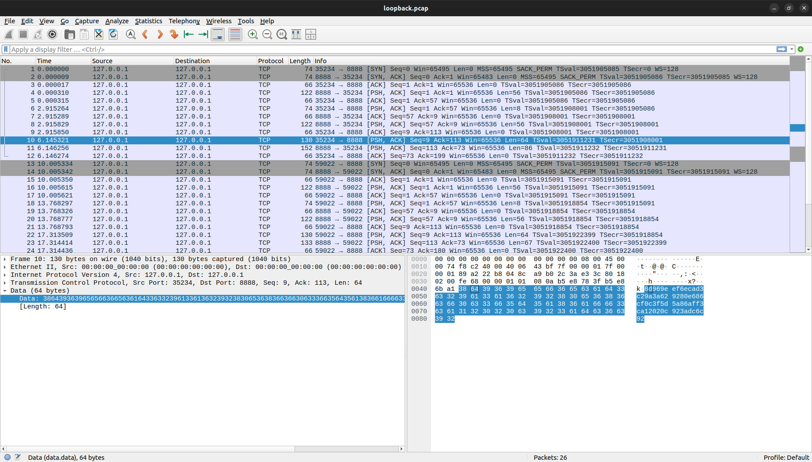

# Secure_Texting

Repo for expirement for Secure Coding Class Project 

## Goal

We want to create a simple chatting app for any n users, so they can talk to each other
over LAN using a server to client model.

The server will contain a database of all the users and their passwords

The goal is then create two version of this application

### Version 1 (Unsecure Secure Texting):

This version will contain all the passwords in the database in cleartext.
In addition, all data transmitted back and forth between client and server is 
unencrpyted

As it currently stands, this version protects against SQL Injection attacks for db access/login auth.

### Version 2 (Secure Secure Texting):

This database will store the **hash** of the password rather than the cleartext.
In addition, all data transmitted back and forth will be encrypted.


### Testing

We will then use wireshark and other methods to take advantage of version 1. We 
will then try and compromise version 2 using those same methods and record our findings.

### Getting Started (Running this code yourself)

You should have VSCode, Git, and Python installed for this

```bash
git clone https://github.com/Crafterzilla/Secure_Texting.git

cd .../Unsecure_Version #add correct path for your project

#You can use ctrl+shift+5 in Windows/Linux to duplicate the current directory into a new terminal

#In your server terminal

python server.py # or python3 depending on system environment

#In your *SEPERATE* client terminal run

python client.py

#Log in with the appropriate username/password which you can find in the .sql file

#Repeat this as many times for as many clients as you want (and to send eachother messages)

```

## Progress

- [ ] Create foundation for code
- [ ] Create Documentation for code
- [ ] Create Version 1
- [ ] Create Version 2
- [ ] Analyze the versions
- [ ] Write Report

## Hashing

Hashing has now been implemented in the latest version, the password message (only) is hashed befored it is sent to the server, which means when intercepted it won't be plain text. The password verification is still successful. Here is the intercepted password message in Wireshark, as you can see its not plaintext, however its still extremely easy to crack.

The given Sha256 encryption took

    Elapsed Time: 0.209s
    Trial Count: 1

to decode. This can be improved upon by using salts or by using a different encryption method like bycrypt. Ideally, we would use a zero-trust authentication system with encrypted messages. In a perfect system we could have Secure Remote Password (SRP) Protocol and TLS (a standard encryption protocol). For this project Hashing and Encryption is more than enough however

### Secure Remote Password (SRP)

- A user to authenticate to a server without sending the password or password hash
- Mutual authentication (both parties verify each other)
- Establishment of a strong shared session key

### TLS (Transport Layer Security)
TLS provides:

- Encrypted channel for all communications
- Server authentication (client verifies server identity)
- Optional client authentication
- Protection against tampering and message forgery

